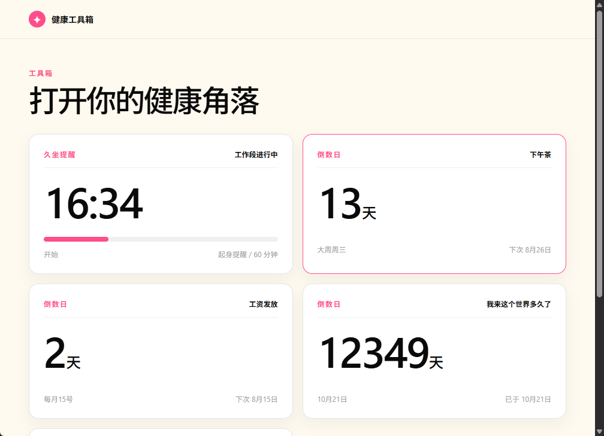
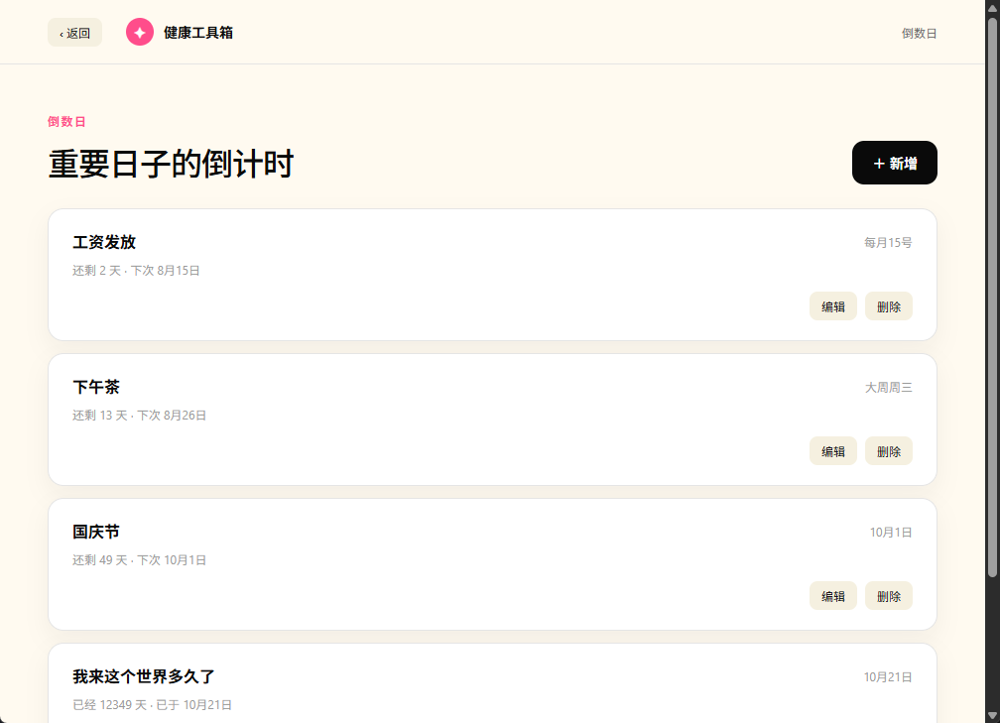

# 健康工具箱 (health-tool)

一个 Windows 桌面健康助手，用 [Wails](https://wails.io) 构建。常驻系统托盘，帮你告别久坐、盯住重要的日子，也记录每天的小习惯。



## 功能

- **顶栏「工具 ▾」**：dashboard 右上角下拉菜单可快速进入各工具的详情页

### 久坐提醒

根据你实际操作电脑的「有效活动」（键盘、鼠标点击、滚轮、明显移动）划分工作段，连续工作达到时长后提醒你起身休息。

- **自动工作段**：开始工作、闲置结束或休息结束后，首次有效活动自动开启新工作段
- **可调提醒**：工作段提醒时长 1–180 分钟（默认 60 分钟，步进 5 分钟），设置从下一工作段生效
- **闲置暂停**：连续 5 分钟无操作自动暂停，不计入工作时间
- **提醒休息期**：提醒后进入休息（默认 3 分钟），期间输入不计入工作
- **每日工作记录**：记录当天工作/休息时间段，展示累计工作时长
- **托盘驻留**：关闭主窗口后仍驻留托盘，持续监控与提醒；单实例运行，重复启动只唤起窗口


### 倒数日

可配置的倒计时卡片，帮你记住重要的日子。

- 四种到期规则：一次性日期、每月固定日、每周固定周几、大小周（每两周）
- 卡片展示标题、规则文案、剩余天数大数字与下一次到期日
- 剩余天数三段语义：「还剩 N 天 / 今天 / 已经 N 天」
- 卡片拖拽排序，顺序持久化



### 计数器

记录重复性小习惯（喝水、吃药、运动等）的次数，每个计数器对应一张 dashboard 卡片。

- **重置周期**：每天 / 每月 / 每年 / 永不清零；次数按周期写入计数桶，周期切换后自动从 0 重新累计
- **一键 +1**：卡片右上角 ＋ 按钮直接加一次，无需进入详情
- **可选目标值**：设置目标后卡片显示「还差 N 次 / 已达成」，未设置则只计数、不设上限
- **详情管理**：新增、编辑、删除计数器，支持减一与直接输入精确调整次数
- **历史回顾**：详情页展示最近 7 个非零历史周期的次数

## 下载

前往 [Releases](https://github.com/hosea3000/health-tool/releases) 下载最新的 `health-tool.exe`（免安装，双击运行）。

> 目前仅提供 Windows 版。

## 从源码构建

### 依赖

- Go 1.25+
- Node.js 22+
- [Wails CLI](https://wails.io/docs/gettingstarted/installation) v2.13.0

### 构建

```bash
# 安装 Wails CLI
go install github.com/wailsapp/wails/v2/cmd/wails@v2.13.0

# 构建当前平台
wails build

# 交叉编译 Windows 产物（可在 Linux/macOS 上执行）
wails build -platform windows/amd64
```

## 开发

```bash
# 实时开发（前端热更新，可在 http://localhost:34115 用浏览器调试）
wails dev
```

开发说明：

- 前端是无框架 Vite 应用，源码在 `frontend/src`，先 `cd frontend && npm install` 再运行
- 运行 Go 测试：`go test ./...`
- 在 Linux/macOS 上开发时，输入监听、托盘、通知、锁屏均为空实现（stub），相关行为仅在 Windows 上生效

## 项目结构

```
.
├── main.go             # 入口，Wails 应用配置
├── app.go              # 业务协调与前后端绑定方法
├── model/              # 前后端数据模型（AppStatus、Settings、CountdownView、CounterView 等）
├── domain/             # 领域逻辑：monitor（状态机）、countdown（到期规则）、counter（计数周期）
├── store/              # 用户数据读写（settings/timeline/countdowns/card_order/counters）
├── *_windows.go        # Windows 实现（输入监听、托盘、通知、锁屏）
├── *_stub.go           # 非 Windows 空实现
└── frontend/src/       # 前端源码（tools/<工具>/ 每个工具一个模块）
```

## 数据存储

所有用户数据保存在系统用户配置目录下的 `health-tool/` 文件夹：

| 文件 | 内容 |
| --- | --- |
| `settings.json` | 提醒时长、休息时长设置 |
| `timeline.json` | 每日工作/休息时间段 |
| `countdowns.json` | 倒数日事件 |
| `card_order.json` | 卡片排序 |
| `counters.json` | 计数器（名称、重置周期、目标值、计数桶） |

Windows 下对应 `C:\Users\<用户名>\AppData\Roaming\health-tool\`。

## 发布

推送 `v*` tag（如 `v0.1.1`）会触发 GitHub Actions，在 Linux 上交叉编译 `windows/amd64` 产物并自动创建 Release。

## 许可证

MIT
